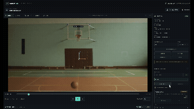

# MotionLab

MotionLab is a local-first browser workspace for extracting physical measurements from ordinary videos. It provides private local video import, analysis-oriented playback controls, editable frame-associated geometry, uniform planar calibration, manual multi-object trajectories, and non-destructive scientific analysis.

**Live Demo:** https://motionlab-qzeybei.vercel.app/

User videos are decoded in the browser from local Object URLs. They are not uploaded, copied to a backend, or sent to analytics.

## Run locally

Requires Node.js 20.19 or newer.

```bash
npm install
npm run dev
```

Then open the local URL printed by Vite and select or drop a video file. Pause on a useful frame and use Select, Point, Line, or Angle above the video.

## Guided workflow

The Phase 10 UX principle is **simple by default, detailed on demand**. The **Getting started** guide derives the next useful action from the current experiment without blocking normal controls or storing separate workflow state.

1. Load a video.
2. Optionally calibrate for real-world units.
3. Create a track.
4. Mark manually or use experimental Assisted Tracking.
5. Analyze the motion.
6. Save the project or export results.

Calibration is optional; pixel-based tracking and analysis remain available without it. Core tasks stay visible, while Assisted Tracking, keyboard shortcuts, video metadata, and exact timing caveats are available on demand in compact disclosures.

To calibrate, choose **Create calibration** in the inspector, click two video points whose real separation is known, then enter the distance and unit. Reference A becomes the default world origin and A → B the default positive X direction; both can be changed independently. A rightward X axis produces upward positive Y. Lines then show physical lengths and Points show derived world coordinates.

To track an object, create and select a track in **Tracking**, enter **Mark point** mode (or press `T`), click the object, step with Left/Right, and repeat. Marking the same timestamp bucket again moves the existing sample instead of creating a duplicate. Enable **Advance after mark** for a click-and-step workflow. **Edit current** lets you drag the active track's sample, and sample rows seek to their exact stored anchor timestamps. Trail visibility can show past/current samples, all samples with future history muted, or only the current sample.

**Assisted tracking (Experimental)** is a productivity aid for semi-automatic tracking, not guaranteed fully automatic object tracking. Select a track, pause on the target, choose **Seed target** (or use an existing current-frame sample), then start the forward-only run. Resolution-aware coarse search handles larger motion, full-resolution refinement preserves native-pixel observations, nearby refined hypotheses are grouped into one local match basin, and recent timestamped motion guides an adaptive predicted-first search. If that search is uncertain, one wider bounded corridor pass tolerates acceleration before normal multi-frame recovery begins. The physical point you clicked remains the measured anchor. Suggestions appear as a dashed trajectory with hollow markers and remain transient until **Accept suggestions** is chosen; **Discard** leaves confirmed track data unchanged apart from an explicitly created seed. An uncertain frame is left unmeasured while a short bounded recovery searches subsequent frames; successful reacquisition resumes normally without filling the gap. Persistent loss, invalid frames, confirmed-sample conflicts, or video end stop visibly instead of creating guessed points. Accepted suggestions become ordinary editable samples in one undoable batch.

The intended workflow is **seed target → generate suggestions → review suggestions → accept when correct → reseed manually if tracking is lost**. Known limitations of the lightweight local template matcher include fast or sudden motion, severe motion blur, occlusion, significant scale or rotation changes, visually repetitive or ambiguous targets, and motion beyond the bounded search limits.

## Assisted Tracking Demo

Seed a target once and let MotionLab follow it frame-by-frame using local template matching, motion guidance, and recovery.



## Save and reopen projects

Use **Project → Save project** to download a versioned `.motionlab` file containing annotations, calibration, confirmed tracks and samples, report metadata/preferences, trail settings, active-track selection, analysis mode, and media time. Project files are JSON and remain under your control. They do **not** contain or upload the source video.

Use **Open project** from the import screen or workspace to restore an experiment. Browser security requires you to select the original local video again. MotionLab compares its filename, resolution, and duration when available and warns before accepting an apparent mismatch. Malformed or unsupported projects are rejected before the current workspace is changed.

## Export scientific results

The compact **Export** menu provides combined chronological CSV, human-readable scientific JSON, and the current graph as standalone SVG. CSV always includes stable track/sample IDs, time and frame references, native `x_px`/`y_px`, analysis space, explicit position/velocity/acceleration units, position, velocity, speed, acceleration components, and acceleration magnitude. Unavailable derivative values remain empty instead of becoming zero. CSV and JSON deliberately remain based on confirmed observations and raw derived kinematics. SVG reflects the current graph, including optional smoothing and model-fit layers, but excludes the interactive playhead, cursor, and hit targets.

## Scientific smoothing and motion models

Raw observations remain the default analysis source. Select **Smoothed** to fit an independent timestamp-aware local quadratic to X and Y at each genuine observation time using the nearest 5, 7, or 9 measured samples. The derived position, velocity, acceleration, displacement, and path distance update with tracking edits and calibration, while every stored `TrackSample` remains unchanged and no gaps or synthetic observations are created. Raw measurements remain visible as secondary graph markers for comparison.

Optional constant-velocity and constant-acceleration least-squares models use the real, potentially irregular media timestamps in either raw or smoothed analysis space. Their parameters, RMSE, per-axis R² where defined, sample count, and time span appear in the numerical inspector; dashed graph curves are display-only and never become measurements or seek targets. Smoothing can clarify noisy trajectories, but it can also hide real rapid changes, so compare it with the raw observations and avoid treating a visually close fit as proof of a physical law.

## Fit diagnostics and residual analysis

When a motion model is selected, MotionLab derives a residual at each genuine observation as **observed position minus model-predicted position** in the selected Raw or Smoothed coordinate space. The inspector reports the existing spatial RMSE, spatial MAE (the mean residual-vector magnitude), maximum residual, mean X/Y residuals, and the largest deviations. Each listed deviation and residual marker seeks to that observation's exact stored timestamp, so the original confirmed point can be reviewed and corrected with the normal Tracking Edit or Delete controls.

The Residuals graph can show X residual, Y residual, or residual magnitude and can be exported as the current standalone SVG. Potential outliers use a conservative magnitude rule only when at least seven observations are available: `median + 4 × 1.4826 × MAD`, with strictly greater values flagged. Flags are visual review aids only—they never remove, reweight, or alter measurements, and a large residual may indicate an unsuitable model rather than a bad track point.

## Experiment reports

Open **Report** from the loaded-video workspace to assemble a human-readable experiment report from the current Raw or Smoothed analysis. Optional project metadata, discussion notes, track inclusion, graph choices, and per-track observation-table choices are saved in the `.motionlab` project. Measurement summaries reuse existing kinematics; an active model adds its existing fit parameters and Phase 11 diagnostics without recomputing or changing observations.

The report can be printed through the browser's **Print / Save PDF** workflow or exported as a standalone offline HTML file with embedded styles and selected SVG graphs. The source video is never embedded. Average velocity is net displacement divided by tracked duration, and average speed is existing cumulative path distance divided by tracked duration; unavailable quantities remain `—`. Potential deviations remain informational, and scientific interpretation belongs in the user-written Discussion / Notes field.

Track samples store exact media anchor timestamps, fallback frame-bucket references, and native-video pixel positions only. Calibration-derived world positions update live without changing the stored trajectory. The live workspace remains session-scoped unless it is explicitly saved as a project.

The full-height right-side **Numerical inspector** derives position, displacement, cumulative path distance, velocity, speed, and acceleration for the active track. Results use the calibration's physical unit when available and explicit `px`, `px/s`, and `px/s²` units otherwise. A collapsible Analysis panel fills the left workspace column below the video/timeline and compares Position (X/Y), Velocity (vx/vy/Speed), or Acceleration (ax/ay/|a|) samples on shared true-timestamp axes. A live video playhead and transient time-only graph cursor support synchronization and background timestamp seeking, while selecting an actual marker seeks to its exact media anchor.

Escape cancels the active canvas interaction; Delete/Backspace removes the current track sample while a tracking mode is active, or the selected annotation otherwise. Ctrl/Cmd+Z and Ctrl/Cmd+Shift+Z apply to the active tracking domain while tracking and to annotations otherwise. Track history also has explicit controls in its panel.

## Validate

```bash
npm test
npm run typecheck
npm run build
npm run test:e2e
```

See `docs/PRODUCT_SPEC.md`, `docs/ARCHITECTURE.md`, and `docs/ROADMAP.md` for current scope and planned phases. Assisted tracking remains experimental. Phase 9–11 scientific-view controls remain session-only; Phase 12 adds a backward-compatible report section to version-1 `.motionlab` projects without persisting derived report values.
