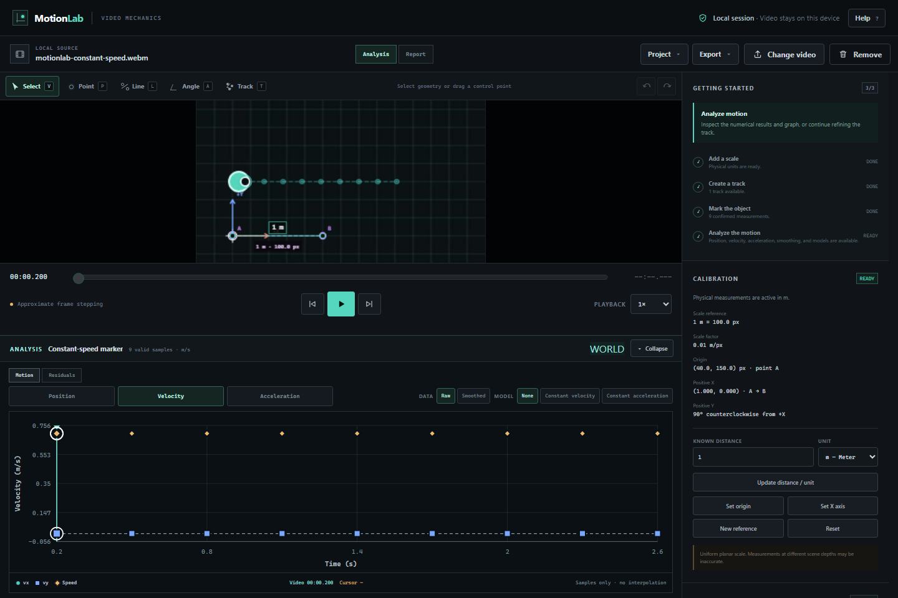
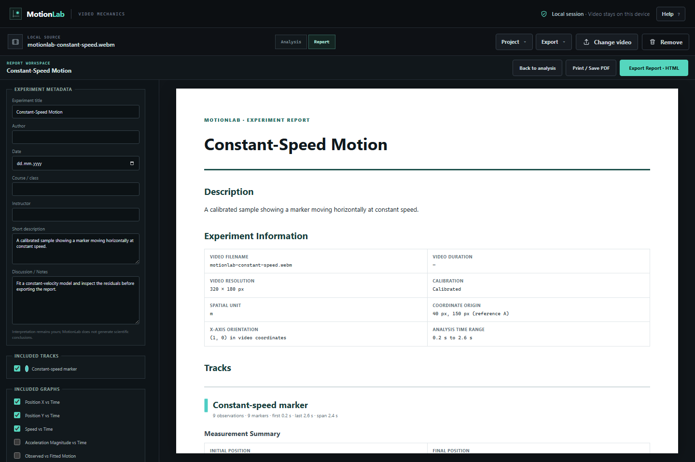

# MotionLab

MotionLab is a local-first browser tool for turning ordinary videos into measurable physics experiments. Calibrate a scene, track an object, inspect timestamp-based kinematics, fit simple motion models, review residuals, and assemble a reproducible experiment report—all in the browser.

**Live Demo:** https://motionlab-qzeybei.vercel.app/

No account, backend, API key, telemetry, or video upload is required.

## Demo

Seed a target once and let MotionLab follow it frame-by-frame using local template matching, motion guidance, and bounded recovery. Assisted Tracking is experimental: review its suggestions before accepting them.


| Tracking and calibrated analysis | Experiment report |
| --- | --- |
|  |  |

More real v1 screenshots: [position analysis](docs/assets/v1-analysis-graphs.png), [model-fit residuals](docs/assets/v1-fit-residuals.png), and [the import screen](docs/assets/v1-empty-import.png).

## What MotionLab Does

MotionLab turns frame-associated video observations into inspectable physical measurements. Stored track points retain their native-video coordinates and exact media timestamps; calibration and analysis are derived from those observations. The workflow stays transparent and editable rather than hiding measurements behind an opaque result.

The bundled **Constant-Speed Motion** sample is available from **Try sample** on the import screen or **Help → Examples**. It loads through the same project parser, relinking, calibration, tracking, analysis, and report paths as a user experiment.

## Features

- Local video import, playback, timestamp seeking, speed control, and approximate frame stepping.
- Frame-associated Point, Line, and Angle annotations with independent undo/redo.
- Planar spatial calibration with scale, origin, axis direction, and physical units.
- Editable multi-object manual tracking with timestamped native-pixel observations.
- Experimental local assisted tracking with reviewable, transient suggestions and manual recovery.
- Position, displacement, path distance, velocity, speed, and acceleration analysis.
- Synchronized position, velocity, acceleration, and residual graphs with SVG export.
- Non-destructive timestamp-aware smoothing over confirmed observations.
- Constant-velocity and constant-acceleration least-squares model fitting.
- Fit diagnostics, observation-aligned residuals, and conservative potential-deviation cues.
- Versioned `.motionlab` project save/reopen with explicit local-video relinking.
- Scientific CSV and JSON exports that preserve missing values and explicit units.
- Configurable experiment reports with print/PDF workflow and standalone offline HTML export.
- First-run onboarding, contextual empty states, keyboard help, examples, About, and Privacy guidance.

## Typical Workflow

`Import → Calibrate → Track → Analyze → Fit → Report`

1. Import a local video, open a saved project, or try the bundled sample.
2. Optionally calibrate a known scene length and coordinate direction. Without calibration, MotionLab analyzes in pixels.
3. Create a track and mark one consistent physical point across video positions; Assisted Tracking may accelerate this step.
4. Inspect motion graphs and numerical quantities, correcting confirmed points as needed.
5. Optionally smooth the analysis and fit a suitable constant-velocity or constant-acceleration model.
6. Review residuals and potential deviations as evidence, not automatic error classifications.
7. Save the project, export scientific data/graphs, or assemble an experiment report.

## Quick Start

Use the [live demo](https://motionlab-qzeybei.vercel.app/), choose **Open MotionLab**, then select **Try sample**; or run MotionLab locally with Node.js 20.19 or newer:

```bash
npm install
npm run dev
```

Open the URL printed by Vite. Selected videos remain local to that browser session.

## Keyboard Shortcuts

Press `?` in MotionLab for the accessible shortcut dialog.

| Group | Shortcut | Action |
| --- | --- | --- |
| Playback | `Space` | Play or pause |
| Playback | `Left` / `Right` | Step approximately one frame |
| Tools | `V` | Select/edit annotations |
| Tools | `P` / `L` / `A` | Point, Line, or Angle annotation |
| Tools | `T` | Start or stop Track Mark |
| Editing | `Delete` / `Backspace` | Delete the current track point or selected annotation |
| Editing | `Escape` | Cancel the active interaction or stop assisted tracking |
| Editing | `Ctrl/Cmd + Z` | Undo in the active editing domain |
| Editing | `Ctrl/Cmd + Shift + Z` or `Ctrl/Cmd + Y` | Redo in the active editing domain |

Shortcuts pause while focus is inside a button, field, menu, or link.

## Project Files

**Project → Save project** downloads a validated version-1 `.motionlab` JSON file. It contains annotations, calibration, confirmed tracks/samples, selected workspace settings, and report metadata/preferences.

Project files never contain the source video, Object URLs, unaccepted Assisted Tracking suggestions, smoothing/model selections, derived report values, or undo history. When reopening a project, browser security requires selecting its original local video again. MotionLab compares filename, resolution, and duration where available and warns before accepting an apparent mismatch. Existing version-1 projects from earlier MotionLab phases remain compatible.

## Export Formats

- **CSV:** one chronological multi-track table with identities, timestamps/frame references, native pixels, derived raw kinematics, explicit spaces/units, and blank unavailable derivatives.
- **Scientific JSON:** human-readable confirmed observations, calibration/annotation context, and raw derived kinematics.
- **SVG:** the current motion or residual graph with title, legend, axes, units, and displayed analysis/model layers; interaction chrome is omitted.
- **Standalone HTML report:** report metadata, summaries, selected SVG graphs, optional observation tables, model diagnostics, and provenance in one offline file. The source video is excluded.
- **Print / Save PDF:** the report workspace provides a clean print-only document through the browser’s print workflow.

## Privacy

Selected videos are read through local browser Object URLs and processed in the browser. MotionLab application code does not upload source videos, derived frames, project data, or reports. `.motionlab` files and standalone reports exclude the original video, and MotionLab requires no account.

The application includes no telemetry or analytics. When using a hosted copy, the hosting provider may retain standard requests for page assets; those requests are separate from the local video and experiment data selected inside MotionLab.

## Scientific Limitations

- A single planar calibration assumes the reference and measured motion occupy approximately the same plane. It does not remove perspective, parallax, lens distortion, or depth error.
- Media timestamps are the timing source. Frame stepping uses an approximate 30 fps fallback and is not a guarantee of exact decoded-frame access.
- Manual and assisted tracking can contain localization mistakes. Assisted Tracking is a bounded template matcher, not an infallible detector.
- Numerical differentiation amplifies measurement noise; smoothing can suppress real rapid changes and does not create more accurate ground truth.
- A close fit describes the selected data and model. It does not prove a physical law, and a large residual may reflect model mismatch rather than a bad observation.

## Tech Stack

- React 19 and strict TypeScript
- Vite 7
- Dependency-free SVG graphing and browser Canvas overlays
- Web Worker-assisted local template matching
- Vitest unit/integration tests
- Playwright browser workflow tests

MotionLab has no runtime state, charting, numerical, analytics, or backend dependency beyond React.

## Development

```bash
npm install
npm run dev
npm run typecheck
npm run build
```

Release and media workflows are documented in [docs/RELEASE_PROCESS.md](docs/RELEASE_PROCESS.md) and [docs/MEDIA_CAPTURE.md](docs/MEDIA_CAPTURE.md).

## Testing

```bash
npm test
npm run typecheck
npm run build
npm run test:e2e
git diff --check
```

## Version

MotionLab **v1.0.0** follows semantic versioning:

- **PATCH** for fixes with no intended feature changes.
- **MINOR** for backward-compatible features.
- **MAJOR** for breaking product or project-format changes.

See [CHANGELOG.md](CHANGELOG.md) and the prepared [v1.0.0 release notes](docs/releases/v1.0.0.md).

## License

MotionLab is released under the [MIT License](LICENSE). Copyright (c) 2026 Kuzey Görgülü.
